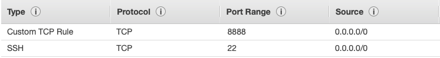

# How to Tunnel Into Jupyter Running on EC2 Using ssh

AWS EC2 instances are very useful for accessing more processing power, memory, and storage without ever having to stop using your laptop. However, EC2 instances are limited in their user interface. With many scientific python programmers using jupyter today, it is very convenient to use jupyter with EC2. 

To make this happen, we just need to launch a jupyter notebook in our EC2 instance and use ssh to "tunnel" into it. The setup for this is fairly simple:

1. Spin up EC2 instance
    - Make sure there is a port open for the jupyter notebook, which can be seen in the image below. We need to be able to SSH into our instance, and then we need to set a port for accessing our jupyter notebook remotely.



2. Create conda environment in EC2
    - Install any and all packages you need for your analysis, **make sure to install jupyter.**

3. Start jupyter notebook in EC2

    ```jupyter notebook --no-browser --port=8887```
    - The port number can be anything, but make sure it doesn't conflict with another process
    - **Make note of the token that is read out to you here, you will need it to login to your remote notebook.**

4. Start SSH tunnel to the server from local machine
    
    ```ssh -N -L localhost:8888:localhost:8887 <user>@<public_dns>```

    - ```-L``` binds the local_address:port1 to a remote_addres:port2
        - This specifies that the connections for the socket on the local host are to be forwarded to the remote host
        - Then the socket listens to the specified bind address 
    - ```-N``` specifies not to execute a remote command. This is useful when forwarding ports as it adds security. 

5. On local computer, enter ```localhost:8888``` into your browser.
    - Enter the token from the EC2 instance. 

6. DONE! Now you are ready to do analysis on AWS hardware but with a friendly jupyter environment.